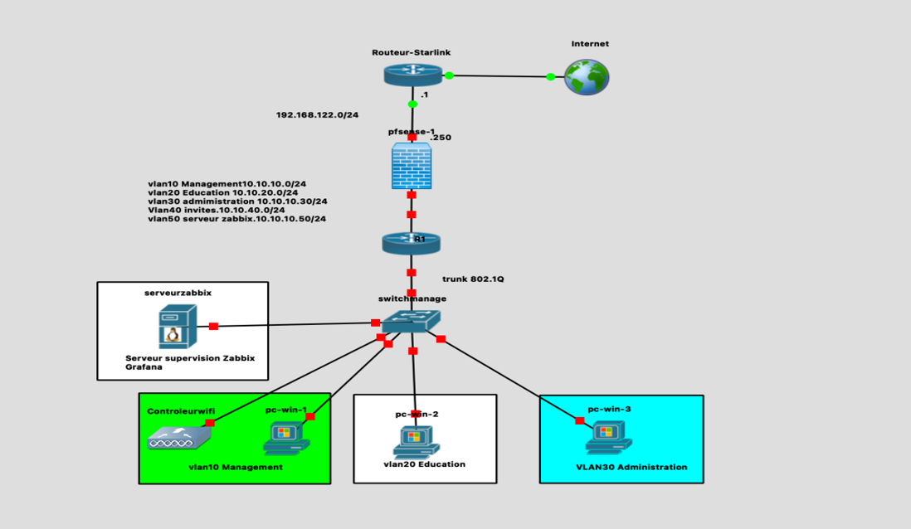
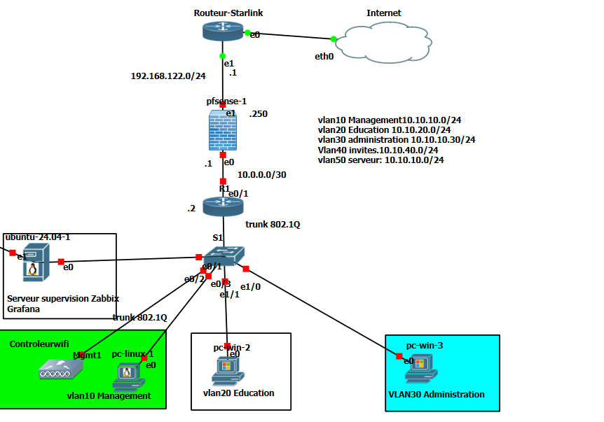
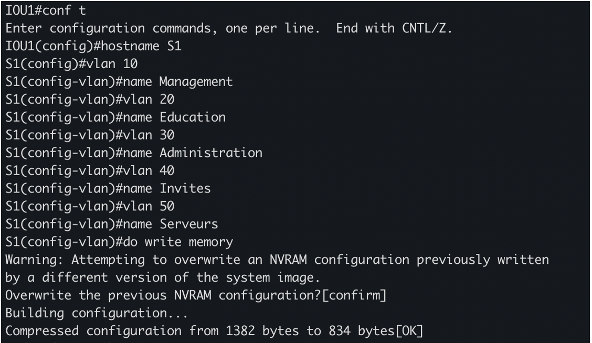
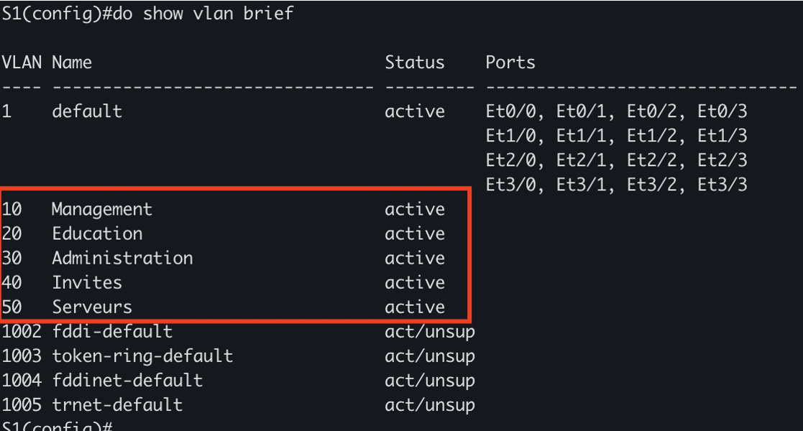
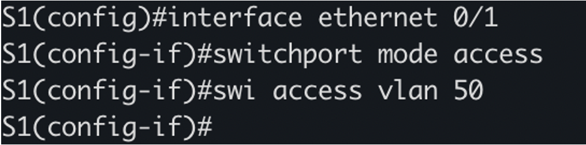
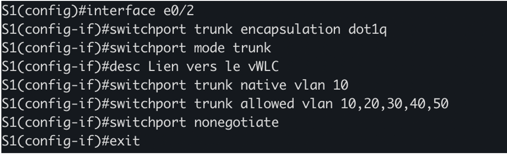

# 🖧 Maquette Réseau - PPP Starlink Éducation

Cette section du dépôt contient l'ensemble des fichiers relatifs à la maquette réseau du projet **PPP Starlink au Service de l'Éducation**.

La maquette est réalisée sous **GNS3** et simule l'infrastructure réseau complète d'une école rurale sénégalaise connectée via Starlink.

---

## 📋 Table des matières

- [Objectifs de la maquette](#-objectifs-de-la-maquette)
- [Architecture réseau](#-architecture-réseau)
- [Définitions des termes techniques](#-définitions-des-termes-techniques)
- [Description des équipements](#-description-des-équipements)
- [Plan d'adressage](#-plan-dadressage)
- [Mise en œuvre](#-mise-en-œuvre)

---

## 🎯 Objectifs de la maquette

Conformément au cahier des charges du projet, la maquette réseau poursuit les objectifs suivants :

### Objectif général

Concevoir, dimensionner et documenter une maquette réseau fonctionnelle et reproductible pour une école rurale sénégalaise connectée via Starlink, dans le cadre du pilote défini par le projet.

### Objectifs spécifiques

| **N°** | **Objectif** | **Livrable associé** |
|---|---|---|
| 1 | Concevoir une architecture réseau hiérarchique intégrant routeur Starlink, pare-feu pfSense, routeur R1, switch S1, contrôleur WiFi vWLC et serveur de supervision | Maquette GNS3 + schéma commenté |
| 2 | Mettre en œuvre la segmentation VLAN pour isoler les flux des élèves, enseignants, invités, administration et serveurs | Configuration du switch S1 |
| 3 | Configurer le routage inter-VLAN selon la technique "Router-on-a-stick" pour assurer la communication entre les segments | Configuration du routeur R1 |
| 4 | Déployer un pare-feu pfSense pour assurer la sécurité, le NAT, la QoS et le filtrage de contenu | Configuration pfSense |
| 5 | Mettre en place un contrôleur WiFi pour gérer les SSIDs éducatifs et administratifs | Configuration vWLC |
| 6 | Configurer le service DHCP pour l'attribution automatique des adresses IP par VLAN | Configuration R1 (pools DHCP) |
| 7 | Déployer une solution de supervision (Zabbix + Grafana) pour le suivi en temps réel de l'infrastructure | Supervision SNMP |
| 8 | Valider l'ensemble de la maquette par des tests de connectivité exhaustifs | Rapport de tests |

### Contraintes du cahier des charges

| **Contrainte** | **Description** |
|---|---|
| Environnement | 100 % local et gratuit |
| Outil de simulation | GNS3 pour la maquette réseau |
| Données réelles | Tarifs Starlink Sénégal, cahier des charges ARTP, statistiques UNESCO/UIT |
| Aucun terminal physique | Le pilote est conçu et chiffré ; un test réel reste possible si l'établissement est connecté |

---

## 🏗️ Architecture réseau

### Schéma synoptique

Le schéma ci-dessous illustre l'architecture globale de la maquette réseau déployée dans GNS3 :



**Légende du schéma :**

| **Élément** | **Description** |
|---|---|
| Routeur-Starlink | Connexion WAN vers Internet (192.168.122.0/24) |
| pfSense | Pare-feu, NAT, QoS (WAN: 192.168.122.55/24, LAN: 10.0.0.1/30) |
| Routeur R1 | Routage inter-VLAN (Router-on-a-stick) |
| Switch-manage | Commutation et segmentation VLAN (Trunk 802.1Q) |
| Serveur Zabbix/Grafana | Supervision de l'infrastructure |
| Contrôleur WiFi | Gestion des SSIDs éducatifs et administratifs |
| pc-win-1 | Poste client du VLAN 10 (Management) |
| pc-win-2 | Poste client du VLAN 20 (Éducation) |
| pc-win-3 | Poste client du VLAN 30 (Administration) |

### Plan d'adressage et VLANs

| **VLAN** | **Nom** | **Sous-réseau** | **Passerelle** | **Usage** |
|---|---|---|---|---|
| 10 | Management | 10.10.10.0/24 | 10.10.10.1 | Administration réseau |
| 20 | Éducation | 10.10.20.0/24 | 10.10.20.1 | Élèves et salles de classe |
| 30 | Administration | 10.10.30.0/24 | 10.10.30.1 | Enseignants et personnel |
| 40 | Invités | 10.10.40.0/24 | 10.10.40.1 | Visiteurs et événements |
| 50 | Serveurs | 10.10.50.0/24 | 10.10.50.1 | LMS, OER, supervision |

### Principes de conception

L'architecture adoptée suit une approche hiérarchique en couches, conforme aux bonnes pratiques de conception réseau. Cette organisation permet une séparation claire des fonctions, une meilleure maintenabilité et une évolutivité facilitée.

- **Couche WAN** : Routeur Starlink pour la connexion Internet
- **Couche sécurité** : pfSense pour le pare-feu, le NAT et la QoS
- **Couche distribution** : Routeur R1 pour le routage inter-VLAN
- **Couche accès** : Switch S1 et contrôleur vWLC pour la connexion des clients
- **Couche supervision** : Serveur Zabbix/Grafana pour le suivi

---

## 📖 Définitions des termes techniques

Cette section définit les principaux termes techniques utilisés dans la maquette réseau.

---

**Starlink**

Starlink est un service de connexion Internet par satellite développé par SpaceX. Il utilise une constellation de satellites en orbite basse (LEO) pour fournir un accès haut débit et faible latence, notamment dans les zones rurales et isolées où les infrastructures terrestres (fibre optique, 4G) sont absentes ou insuffisantes.

---

**VLAN (Virtual Local Area Network)**

Un VLAN est un réseau local virtuel permettant de segmenter logiquement un réseau physique en plusieurs réseaux distincts. Chaque VLAN isole le trafic des autres VLANs, ce qui améliore la sécurité et la gestion de la bande passante.

---

**Trunk (802.1Q)**

Un trunk est une liaison physique capable de transporter le trafic de plusieurs VLANs simultanément. Le protocole 802.1Q ajoute un tag VLAN à chaque trame pour identifier son appartenance à un VLAN spécifique.

---

**Router-on-a-stick**

Le Router-on-a-stick est une technique permettant à un routeur d'assurer le routage entre plusieurs VLANs en utilisant une seule interface physique, subdivisée en sous-interfaces logiques. Chaque sous-interface est associée à un VLAN et possède sa propre adresse IP.

---

**Sous-interface**

Une sous-interface est une interface logique créée sur une interface physique. Chaque sous-interface est associée à un VLAN spécifique et possède sa propre adresse IP. Elle permet au routeur de traiter le trafic de plusieurs VLANs sur une seule interface physique.

---

**VLAN natif**

Le VLAN natif est le VLAN dont le trafic n'est pas tagué sur un trunk. Par convention, le VLAN 10 (Management) est utilisé comme VLAN natif dans ce projet. Le trafic non tagué est automatiquement associé à ce VLAN.

---

**DHCP (Dynamic Host Configuration Protocol)**

Le DHCP est un protocole permettant l'attribution automatique d'adresses IP aux équipements d'un réseau. Il évite la configuration manuelle des adresses IP sur chaque poste client.

---

**Pool DHCP**

Un pool DHCP est un ensemble d'adresses IP qu'un serveur DHCP peut attribuer aux clients. Chaque VLAN dispose de son propre pool, ce qui permet une gestion différenciée des adresses par segment réseau.

---

**Bail DHCP**

Le bail DHCP est la durée pendant laquelle une adresse IP est attribuée à un client. À l'expiration du bail, le client doit renouveler son adresse auprès du serveur DHCP.

---

**NAT (Network Address Translation)**

Le NAT est une technique permettant de traduire les adresses IP privées en adresses publiques pour l'accès à Internet. Il permet à plusieurs équipements d'un réseau privé de partager une seule adresse IP publique.

---

**Pare-feu (Firewall)**

Un pare-feu est un équipement ou un logiciel filtrant le trafic réseau selon des règles définies. Il contrôle les flux entrants et sortants pour protéger le réseau contre les intrusions. pfSense est utilisé comme pare-feu dans ce projet.

---

**QoS (Quality of Service)**

La QoS est un mécanisme permettant de prioriser certains types de trafic (voix, vidéo) sur d'autres (navigation web, récréatif). Elle garantit une qualité optimale pour les usages critiques, notamment la visioconférence et les plateformes LMS.

---

**SNMP (Simple Network Management Protocol)**

Le SNMP est un protocole standard permettant la supervision des équipements réseau. Il permet à un serveur de supervision (Zabbix) de collecter des métriques sur l'état et les performances des équipements.

---

**Communauté SNMP**

La communauté SNMP est un mot de passe permettant l'accès aux informations SNMP d'un équipement. Dans ce projet, la communauté `public` est utilisée avec un accès en lecture seule (RO).

---

**SSID (Service Set Identifier)**

Le SSID est le nom du réseau WiFi diffusé par un point d'accès. Deux SSIDs sont configurés dans ce projet : `Starlink-Education` et `Starlink-Admin`.

---

**WPA2-PSK**

WPA2-PSK (Wi-Fi Protected Access 2 - Pre-Shared Key) est un protocole de sécurité WiFi utilisant une clé pré-partagée pour l'authentification.

---

**WLC (Wireless LAN Controller)**

Un WLC est un contrôleur gérant centralement les points d'accès WiFi et les SSIDs.

---

**vWLC**

Le vWLC est la version virtualisée du contrôleur WiFi Cisco.

---

**Zabbix**

Zabbix est une solution open source de supervision réseau.

---

**Grafana**

Grafana est une plateforme de visualisation de données et de tableaux de bord.

---

**GNS3**

GNS3 (Graphical Network Simulator 3) est un simulateur réseau permettant de reproduire des topologies complexes.

---

**pfSense**

pfSense est une distribution FreeBSD spécialisée dans les fonctions de pare-feu et de routage.

---

**LEO (Low Earth Orbit)**

LEO désigne l'orbite basse terrestre, utilisée par les satellites Starlink.

---

**ARTP**

L'ARTP (Autorité de Régulation des Télécommunications et des Postes) est l'organisme sénégalais chargé de réguler le secteur des télécommunications.

---

**New Deal Technologique**

Le New Deal Technologique est un programme gouvernemental sénégalais visant à connecter un million de citoyens d'ici fin 2026.

---

**GIGA**

GIGA est une initiative conjointe de l'UNICEF et de l'UIT pour connecter toutes les écoles du monde à Internet.

---

**LMS (Learning Management System)**

Un LMS est une plateforme de gestion de l'apprentissage en ligne (Moodle, Canvas).

---

**OER (Open Educational Resources)**

Les OER sont des ressources éducatives libres et gratuites, accessibles en ligne.

---

## 🖥️ Description des équipements

### Routeur Starlink

**Modèle / Type :** Kit Standard Starlink

**Rôle Principal :** Connexion WAN vers Internet

**Interfaces Clés :** DHCP sur `192.168.122.0/24`

**Qu'est-ce que Starlink ?**

Starlink est un service de connexion Internet par satellite développé par SpaceX. Il utilise une constellation de satellites en orbite basse (LEO) pour fournir un accès haut débit et faible latence. Contrairement aux satellites géostationnaires traditionnels (VSAT), les satellites Starlink sont situés à environ 550 km d'altitude, ce qui réduit considérablement la latence (20 à 40 ms contre 600 ms pour le VSAT).

**But de Starlink dans cette maquette**

Dans le cadre de ce projet, Starlink a pour but de **connecter une école rurale sénégalaise à Internet** là où les infrastructures terrestres (fibre optique, 4G) sont absentes ou insuffisantes. Il permet :

- L'accès aux **plateformes pédagogiques en ligne** (Moodle, Canvas)
- La **visioconférence** pour les cours à distance
- L'accès aux **ressources éducatives libres** (OER)
- La **formation des enseignants** à distance
- La **supervision** de l'infrastructure réseau

**Fonctions assurées :**

- **Connectivité satellitaire** : Établissement et maintien de la liaison avec les satellites Starlink.
- **Attribution d'adresses IP** : Distribution d'adresses IP dynamiques via DHCP sur le réseau local `192.168.122.0/24`.
- **Accès Internet** : Fourniture d'un accès haut débit avec des débits pouvant atteindre 305 Mbps en réception et 20 à 40 Mbps en émission.

**Interconnexion :** Le routeur Starlink est connecté à l'interface WAN de pfSense (`192.168.122.55/24`).

---

### pfSense

**Modèle / Type :** pfSense 2.7.2-RELEASE

**Rôle Principal :** Pare-feu, NAT, QoS, Filtrage de contenu

**Interfaces Clés :** WAN sur `192.168.122.55/24` et LAN sur `10.0.0.1/30`

pfSense constitue le cœur de la sécurité et de la gestion du réseau. Il s'agit d'une distribution FreeBSD spécialisée dans les fonctions de pare-feu et de routage. Il occupe une position centrale entre le routeur Starlink et le routeur R1.

**Fonctions assurées :**

- **Pare-feu** : Analyse de chaque paquet réseau et décision d'autorisation ou de blocage selon des règles définies.
- **NAT** : Traduction des adresses IP privées des VLANs (`10.10.0.0/16`) en l'adresse publique du routeur Starlink.
- **QoS** : Priorisation du trafic pédagogique (visioconférence, LMS) sur le trafic récréatif.
- **Filtrage de contenu** : Blocage des sites non éducatifs via Squid Proxy et pfBlockerNG.
- **SNMP** : Exposition des métriques pour la supervision par Zabbix.

**Interconnexion :** L'interface WAN (`em0`) est connectée au routeur Starlink. L'interface LAN (`em1`) est connectée au routeur R1.

---

### Routeur R1

**Modèle / Type :** Cisco 4321

**Rôle Principal :** Routage inter-VLAN (Router-on-a-stick) et serveur DHCP

**Interfaces Clés :** Sous-interfaces pour les VLANs 10, 20, 30, 40, 50 et interface e0/1 sur `10.0.0.2/30`

Le routeur R1 assure le routage entre les différents VLANs et intègre le service DHCP pour l'attribution automatique des adresses IP.

**Fonctions assurées :**

- **Routage inter-VLAN** : Acheminement du trafic entre les différents segments logiques du réseau.
- **Service DHCP** : Attribution automatique des adresses IP aux clients de chaque VLAN via des pools dédiés.
- **Router-on-a-stick** : Utilisation d'une seule interface physique subdivisée en sous-interfaces pour transporter le trafic de tous les VLANs.
- **Passerelle par défaut** : Chaque sous-interface sert de passerelle pour son VLAN respectif.

**Interconnexion :** R1 est connecté au switch S1 via l'interface `e0/0` en mode trunk. R1 est connecté à pfSense via l'interface `e0/1` (`10.0.0.2/30`).

---

### Switch S1

**Modèle / Type :** Cisco 2960

**Rôle Principal :** Commutation et segmentation VLAN

**Interfaces Clés :** Trunk vers R1 sur e0/0, trunk vers vWLC sur e0/2, ports d'accès pour les clients

Le switch S1 constitue la couche d'accès et de distribution du réseau. Il assure la connectivité physique des clients et la segmentation logique via les VLANs.

**Fonctions assurées :**

- **Commutation Ethernet** : Acheminement des trames entre les ports au niveau de la couche 2.
- **Segmentation VLAN** : Isolation logique du réseau en segments virtuels correspondant aux profils d'utilisateurs.
- **Ports d'accès** : Configuration des ports connectés aux utilisateurs finaux (un VLAN par port).
- **Ports trunk** : Configuration des ports connectés aux équipements d'infrastructure (transport de plusieurs VLANs).

**Interconnexion :** Le switch S1 est connecté au routeur R1 (trunk `e0/0`), au contrôleur vWLC (trunk `e0/2`) et aux clients (ports d'accès).

---

### Contrôleur WiFi (vWLC)

**Modèle / Type :** Cisco 2504 (version virtualisée)

**Rôle Principal :** Contrôleur WiFi

**Interfaces Clés :** Interfaces dynamiques pour les VLANs 20 et 30, SSIDs éducatifs et administratifs

Le vWLC gère les points d'accès sans fil et les connexions des utilisateurs mobiles.

**Fonctions assurées :**

- **Gestion des points d'accès** : Configuration, supervision et mise à jour des APs.
- **Gestion des SSIDs** : Création et gestion des réseaux WiFi (`Starlink-Education` et `Starlink-Admin`).
- **Authentification et sécurité** : Authentification des utilisateurs via WPA2-PSK.
- **Itinérance (Roaming)** : Transition transparente entre les points d'accès.

**Interconnexion :** Le vWLC est connecté au switch S1 via le port `e0/2` en mode trunk.

---

### Serveur Zabbix

**Modèle / Type :** Ubuntu 24.04 LTS

**Rôle Principal :** Supervision et collecte de métriques réseau

**Interfaces Clés :** SNMP vers les équipements supervisés, interface web pour l'administration

Zabbix collecte en continu des métriques sur l'état et la performance des équipements réseau.

**Fonctions assurées :**

- **Collecte de métriques** : Interrogation régulière des équipements via SNMP.
- **Stockage historique** : Conservation des données dans une base MySQL.
- **Détection d'anomalies** : Comparaison des métriques avec des seuils et déclenchement d'alertes.
- **Visualisation** : Interface web pour consulter l'état des équipements.

**Interconnexion :** Le serveur Zabbix est connecté au switch S1 sur le VLAN 50 avec l'adresse `10.10.50.100/24`.

---

### Grafana

**Modèle / Type :** Ubuntu 24.04 LTS

**Rôle Principal :** Visualisation et tableaux de bord

**Interfaces Clés :** Connexion à la base de données Zabbix, interface web

Grafana permet de créer des tableaux de bord personnalisés à partir des données collectées par Zabbix.

**Fonctions assurées :**

- **Visualisation avancée** : Graphiques (jauges, courbes, barres) pour représenter les métriques.
- **Tableaux de bord personnalisés** : Vues adaptées aux différents publics (administrateurs, direction).
- **Alertes visuelles** : Indicateurs d'alerte directement sur les tableaux de bord.
- **Partage** : Diffusion des tableaux de bord avec des droits différenciés.

**Interconnexion :** Grafana est installé sur le même serveur que Zabbix ou sur un serveur dédié.

---

### Postes Clients

**Modèle / Type :** PC, ordinateurs portables et smartphones

**Rôle Principal :** Simulation des usagers de l'école

**Interfaces Clés :** Répartis sur les VLANs 10, 20, 30 et 40

Les postes clients représentent les utilisateurs finaux : élèves, enseignants, personnel administratif et invités.

**Types de clients :**

- **Clients du VLAN 20 (Éducation)** : Élèves et postes dans les salles de classe.
- **Clients du VLAN 30 (Administration)** : Enseignants et personnel administratif.
- **Clients du VLAN 10 (Management)** : Administrateurs réseau.
- **Clients du VLAN 40 (Invités)** : Visiteurs et participants à des événements.

**Interconnexion :** Les postes clients sont connectés aux ports d'accès du switch S1 ou aux SSIDs du vWLC.

---

## 📊 Plan d'adressage

### VLANs et sous-réseaux

| **VLAN** | **Nom** | **Sous-réseau** | **Passerelle** | **Plage DHCP** | **Usage** |
|---|---|---|---|---|---|
| 10 | Management | 10.10.10.0/24 | 10.10.10.1 | 10.10.10.100-200 | Administration réseau |
| 20 | Éducation | 10.10.20.0/24 | 10.10.20.1 | 10.10.20.100-250 | Élèves et salles de classe |
| 30 | Administration | 10.10.30.0/24 | 10.10.30.1 | 10.10.30.100-200 | Enseignants et personnel |
| 40 | Invités | 10.10.40.0/24 | 10.10.40.1 | 10.10.40.100-150 | Visiteurs et événements |
| 50 | Serveurs | 10.10.50.0/24 | 10.10.50.1 | Statique | LMS, OER, supervision |

### Adressage des équipements d'infrastructure

| **Équipement** | **Interface** | **Adresse IP** | **VLAN** |
|---|---|---|---|
| Routeur Starlink | WAN | 192.168.122.1/24 | - |
| pfSense | WAN (em0) | 192.168.122.55/24 | - |
| pfSense | LAN (em1) | 10.0.0.1/30 | - |
| Routeur R1 | e0/1 | 10.0.0.2/30 | - |
| Routeur R1 | e0/0.10 | 10.10.10.1/24 | 10 |
| Routeur R1 | e0/0.20 | 10.10.20.1/24 | 20 |
| Routeur R1 | e0/0.30 | 10.10.30.1/24 | 30 |
| Routeur R1 | e0/0.40 | 10.10.40.1/24 | 40 |
| Routeur R1 | e0/0.50 | 10.10.50.1/24 | 50 |
| Switch S1 | Management | 10.10.10.2/24 | 10 |
| vWLC | Management | 10.10.10.250/24 | 10 |
| vWLC | vlan20_edu | 10.10.20.250/24 | 20 |
| vWLC | vlan30_admin | 10.10.30.250/24 | 30 |
| Serveur Zabbix | Serveurs | 10.10.50.100/24 | 50 |

### SSIDs WiFi

| **SSID** | **VLAN** | **Interface** | **Sécurité** | **Usage** |
|---|---|---|---|---|
| `Starlink-Education` | 20 | vlan20_edu | WPA2-PSK | Élèves |
| `Starlink-Admin` | 30 | vlan30_admin | WPA2-PSK | Enseignants |

---

## 🚀 Mise en œuvre

### Prérequis

**Logiciels requis :**

- **GNS3** 2.2 ou supérieur
- **GNS3 VM** (recommandé)
- **Images Cisco** : IOS pour routeur 4321 et switch 2960
- **pfSense** : image ISO ou VM (version 2.7.2 ou supérieure)
- **vWLC** : image Cisco WLC (version 8.10 ou supérieure)

**Ressources système recommandées :**

| **Ressource** | **Minimum** | **Recommandé** |
|---|---|---|
| RAM | 8 Go | 16 Go |
| CPU | 4 cœurs | 8 cœurs |
| Disque | 50 Go | 100 Go |

### Installation

**1. Cloner le dépôt :**

```bash
git clone https://github.com/paulepricna/ppp-starlink-education.git
cd ppp-starlink-education/maquette
```

### 2. Ouvrir le projet GNS3

1. Lancez **GNS3**
2. Cliquez sur **File > Open project**
3. Sélectionnez le fichier `gns3_project/project.gns3`
4. Le projet s'ouvre avec l'ensemble des équipements

### 3. Démarrer les équipements

1. Cliquez sur le bouton **Start all devices**
2. Attendez que tous les équipements soient démarrés (voyants verts)
3. Vérifiez que les liens sont actifs

### 4. Charger les configurations

Pour chaque équipement, chargez la configuration depuis le dossier `configs/`.

---

### Configuration des VLANs sur le Switch S1

#### Étape 0 : Architecture et ports du switch S1

Avant de commencer la configuration, voici le schéma de la maquette réseau montrant les ports du switch S1 et leurs interconnexions.



**Sur ce schéma, on peut identifier les ports du switch S1 :**

| **Port** | **Mode** | **VLAN(s)** | **Destination** |
|---|---|---|---|
| e0/0 | Trunk | 10,20,30,40,50 | Routeur R1 |
| e0/1 | Access | 50 | Serveur Zabbix (Ubuntu 24.04) |
| e0/2 | Trunk | 10,20,30 | Contrôleur WiFi vWLC |
| e0/3 | Access | 10 | pc-win-1 (Management) |
| e1/0 | Access | 30 | pc-win-3 (Administration) |
| e1/1 | Access | 20 | pc-win-2 (Éducation) |

**Explication des connexions :**

- **Trunk e0/0** : Liaison vers le routeur R1, transporte tous les VLANs (10, 20, 30, 40, 50)
- **Trunk e0/2** : Liaison vers le contrôleur vWLC, transporte les VLANs 10, 20 et 30
- **Ports d'accès** : Chaque port est assigné à un VLAN spécifique (un port = un VLAN)
- **VLAN natif** : Le VLAN 10 (Management) est utilisé comme VLAN natif sur les trunks

---

#### Étape 1 : Création des VLANs

La première étape consiste à créer les différents VLANs qui segmenteront le réseau de l'école.




**Commandes exécutées :**

```cisco
S1(config)#vlan 10
S1(config-vlan)#name Management
S1(config-vlan)#vlan 20
S1(config-vlan)#name Education
S1(config-vlan)#vlan 30
S1(config-vlan)#name Administration
S1(config-vlan)#vlan 40
S1(config-vlan)#name Invites
S1(config-vlan)#vlan 50
S1(config-vlan)#name Serveurs
S1(config-vlan)#exit
```

**Explication :**

- **VLAN 10 (Management)** : Dédié à l'administration réseau
- **VLAN 20 (Education)** : Dédié aux élèves et aux salles de classe
- **VLAN 30 (Administration)** : Dédié aux enseignants et au personnel
- **VLAN 40 (Invites)** : Dédié aux visiteurs et événements
- **VLAN 50 (Serveurs)** : Dédié aux serveurs (LMS, OER, supervision)

---

#### Étape 3 : Vérification des VLANs créés

Après la création des VLANs sur le switch S1, il est essentiel de vérifier que ces derniers sont correctement configurés et opérationnels. Cette vérification permet de s'assurer que la segmentation réseau est fonctionnelle avant de passer à la configuration des ports d'accès et des trunks.



---

##### Vérification avec la commande `show vlan brief`

**Commande exécutée :**

```cisco
S1(config)#do show vlan brief

#### Étape 2 : Configuration des ports d'accès

Une fois les VLANs créés, il est nécessaire de configurer les ports d'accès du switch S1. Un port d'accès est un port qui ne transporte le trafic que d'un seul VLAN. Chaque port est assigné à un VLAN spécifique en fonction du type d'utilisateur ou d'équipement qui y est connecté.

---
```
##### Configuration du port d'accès pour le VLAN 50 (Serveurs)

La capture ci-dessous présente la configuration du port Ethernet 0/1 du switch S1 en mode accès pour le VLAN 50 (Serveurs).



**Commandes exécutées :**

```cisco
S1(config)#interface ethernet 0/1
S1(config-if)#switchport mode access
S1(config-if)#switchport access vlan 50
S1(config-if)#
#### Configuration du port d'accès pour le VLAN 50 (Serveurs)

La commande `interface ethernet 0/1` sélectionne le port physique Ethernet 0/1 du switch S1. Ce port est identifié par son emplacement physique sur le switch. Il est destiné à être connecté au serveur Zabbix, qui doit appartenir au VLAN 50 (Serveurs).

La commande `switchport mode access` configure le port en mode accès. Un port en mode accès ne transporte le trafic que d'un seul VLAN, contrairement à un port trunk qui peut transporter plusieurs VLANs. Cette configuration est adaptée pour un port connecté à un terminal utilisateur ou à un serveur.

La commande `switchport access vlan 50` assigne le port au VLAN 50 (Serveurs). Tout le trafic entrant et sortant sur ce port sera associé à ce VLAN. Le switch ajoutera automatiquement le tag VLAN 50 aux trames sortant de ce port et enlèvera le tag pour les trames entrantes, simplifiant ainsi la configuration du serveur connecté.
```
#### Configuration du port Trunk vers le contrôleur WiFi (vWLC)

La capture ci-dessous présente la configuration du port Ethernet 0/2 du switch S1 en mode trunk vers le contrôleur WiFi vWLC.



**Commandes exécutées :**

```cisco
S1(config)#interface e0/2
S1(config-if)#switchport trunk encapsulation dot1q
S1(config-if)#switchport mode trunk
S1(config-if)#desc Lien vers le vWLC
S1(config-if)#switchport trunk native vlan 10
S1(config-if)#switchport trunk allowed vlan 10,20,30,40,50
S1(config-if)#switchport nonegotiate
S1(config-if)#exit